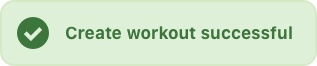
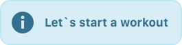
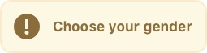
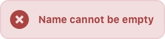
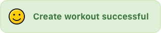
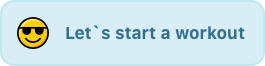
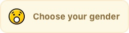
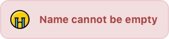

# DTMessageBar

[](https://swift.org/)
[](http://cocoadocs.org/docsets/DTMessageBar)
[](https://cocoapods.org/pods/DTMessageBar)
[](https://github.com/Carthage/Carthage)

## Introduction

Simple message bar.


Standard Style.









Emoji Style.









## Installation

### Requirement

iOS 8.4+

### [CocoaPods](http://cocoapods.org)

To install DTMessageBar add a dependency to your Podfile:

```
pod "DTMessageBar"
```

### [Carthage](https://github.com/Carthage/Carthage)

To install DTMessageBar add a dependency to your Cartfile:

```
github "danjiang/DTMessageBar"
```

```
carthage update --platform ios
```

## Usage

### Import

```swift
import DTMessageBar
```

### Use

```swift
DTMessageBar.error(message: "Good Jobs") // Top is default position
DTMessageBar.success(message: "Good Jobs", position: .top)
DTMessageBar.info(message: "Good Jobs", position: .center)
DTMessageBar.warning(message: "Good Jobs", position: .bottom)
```

### Customize

#### Icon Set

```swift
DTMessageBar.iconSet = .standard // Standard is default icon set
DTMessageBar.iconSet = .emoji
DTMessageBar.iconSet = .custom // You should put your own icon set in Assets.xcassets with name as success_custom, info_custom, warning_custom and error_custom.
```

#### Theme

```swift
DTMessageBar.theme = DTMessageBar.DefaultTheme() // Default theme

// Impelement DTMessageBarTheme to provide your own theme

struct DarkTheme: DTMessageBarTheme {
  
  var successBorderColor: UIColor {
    return UIColor.black
  }
  
  var successBackgroundColor: UIColor {
    return UIColor(red:0.11, green:0.11, blue:0.15, alpha:0.8)
  }
  
  var successTextColor: UIColor {
    return UIColor.white
  }
  
  var infoBorderColor: UIColor {
    return UIColor.black
  }
  
  var infoBackgroundColor: UIColor {
    return UIColor(red:0.11, green:0.11, blue:0.15, alpha:0.8)
  }
  
  var infoTextColor: UIColor {
    return UIColor.white
  }
  
  var warningBorderColor: UIColor {
    return UIColor.black
  }
  
  var warningBackgroundColor: UIColor {
    return UIColor(red:0.11, green:0.11, blue:0.15, alpha:0.8)
  }
  
  var warningTextColor: UIColor {
    return UIColor.white
  }
  
  var errorBorderColor: UIColor {
    return UIColor.black
  }
  
  var errorBackgroundColor: UIColor {
    return UIColor(red:0.11, green:0.11, blue:0.15, alpha:0.8)
  }
  
  var errorTextColor: UIColor {
    return UIColor.white
  }

}

DTMessageBar.theme = DarkTheme()
```